# Whiskey Tasting

This is a web application for organizing whiskey tasting events. It allows administrators to set up themes and whiskeys for tastings, participants to submit ratings on aroma, flavor, and finish, and everyone to view results and rankings.

The application is designed to be simple and accessible, including for elderly users who may not be comfortable with technology. For this reason, it has minimal authentication—participants enter only their names to join a tasting, with no passwords, accounts, or complex login processes.

I developed this project on NixOS to learn more about the operating system and its capabilities for software development.

## Screenshots

Here are some screenshots of the application in action:

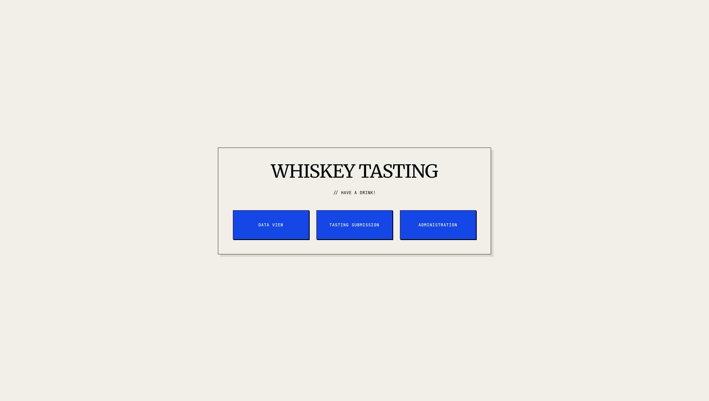
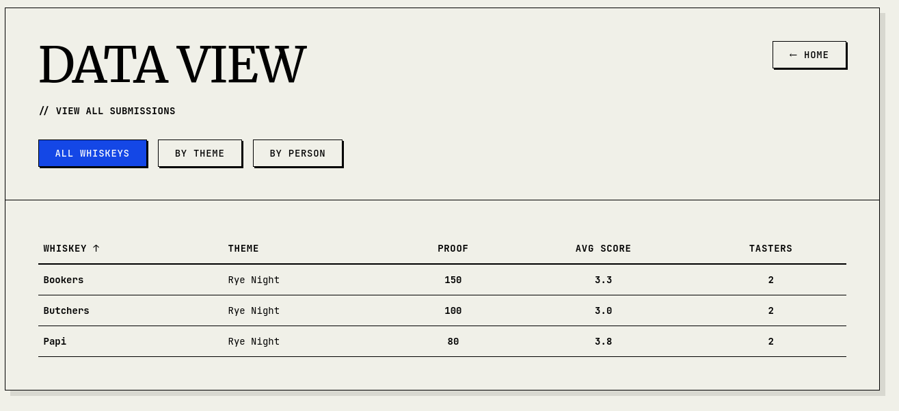
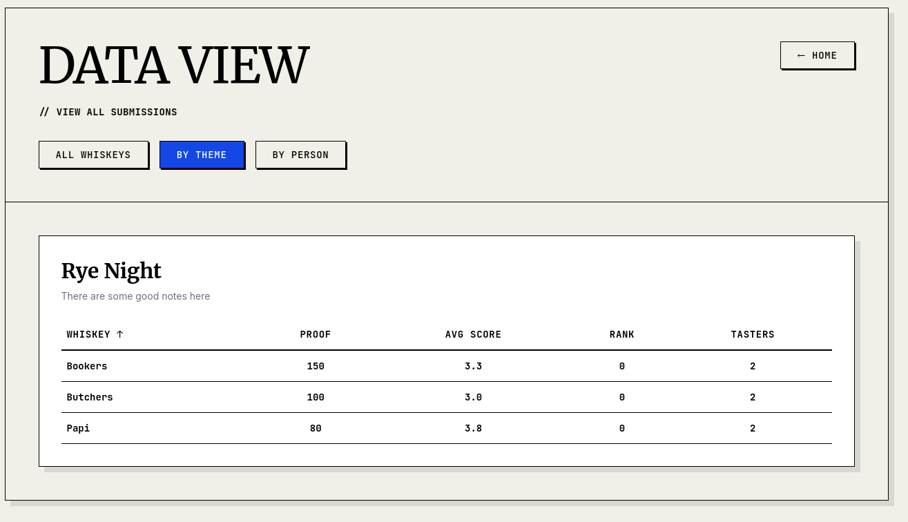
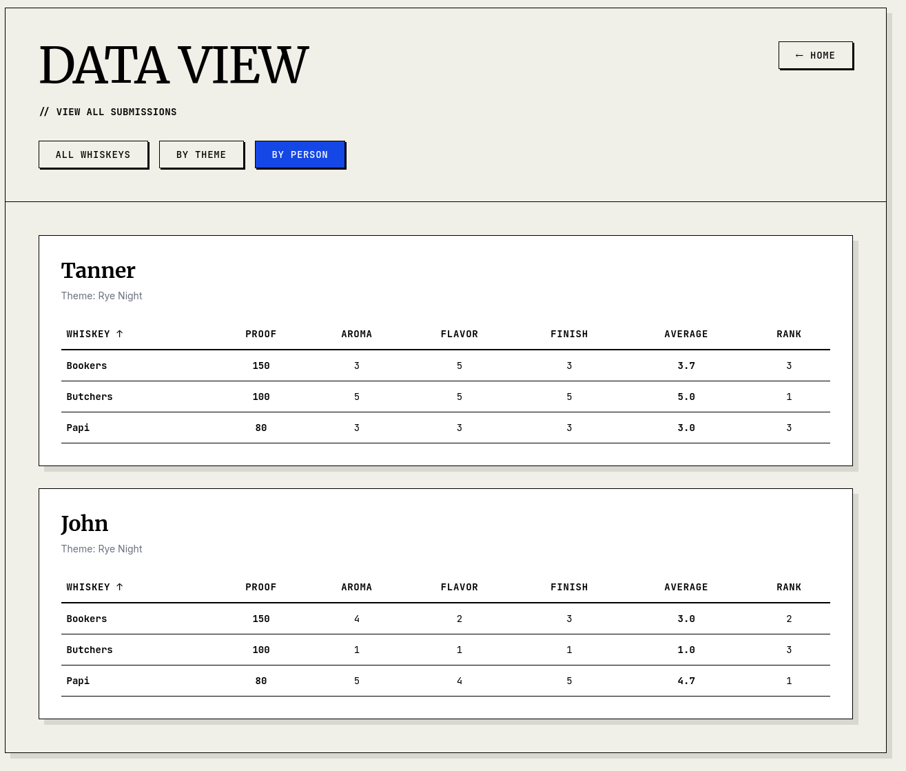
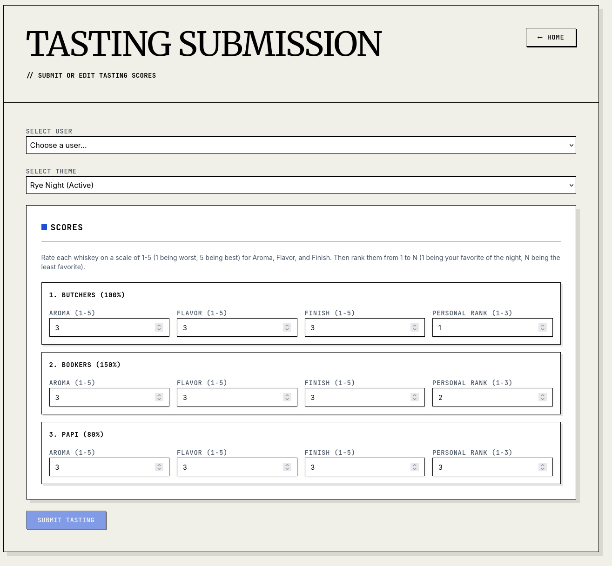
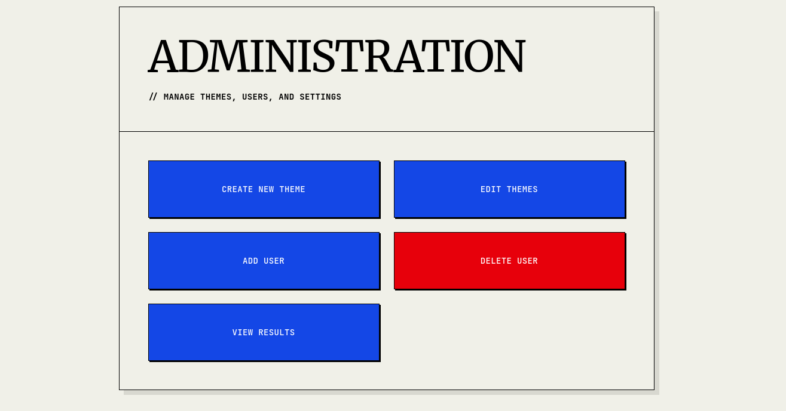
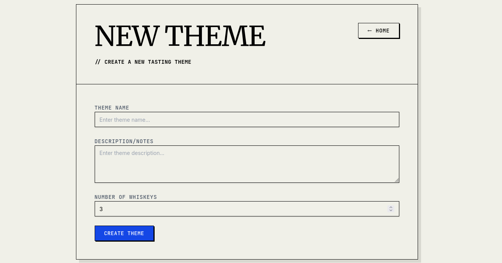
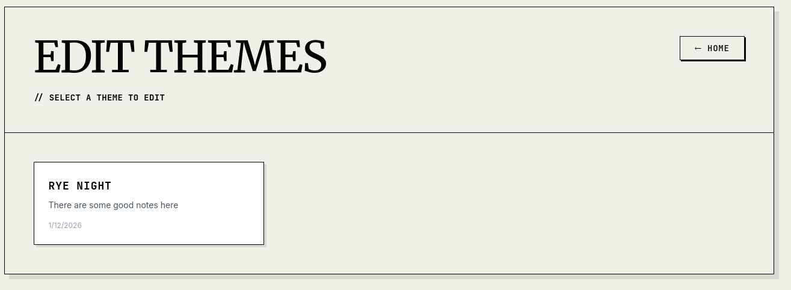
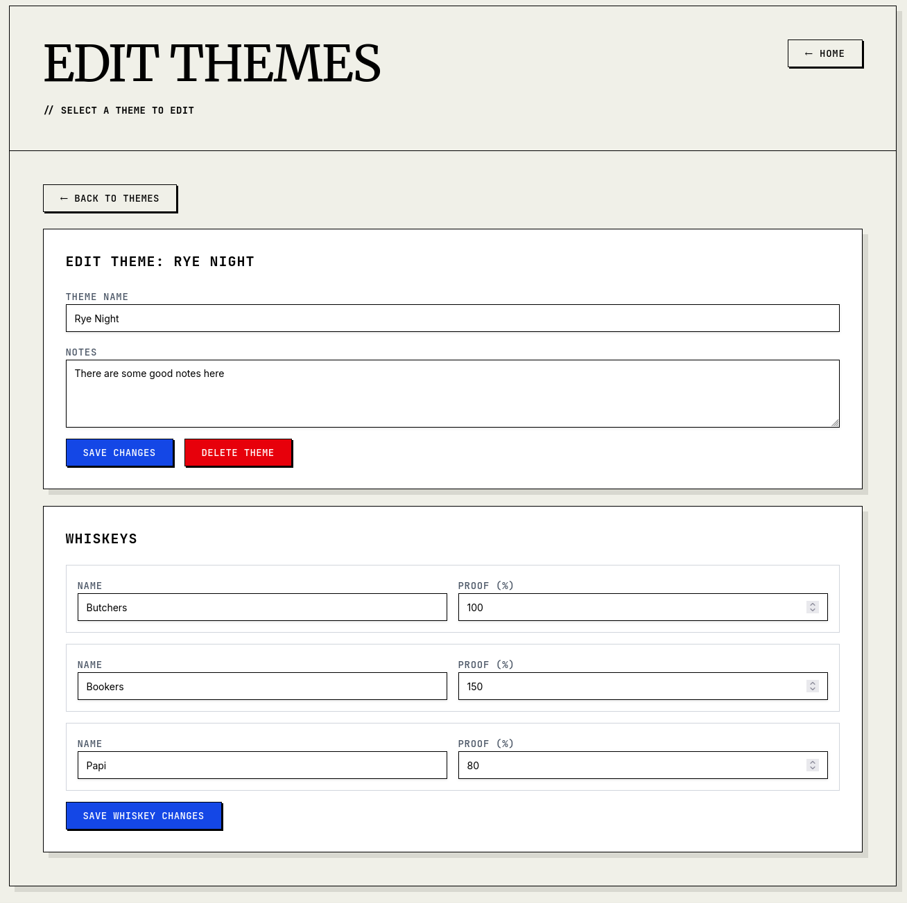
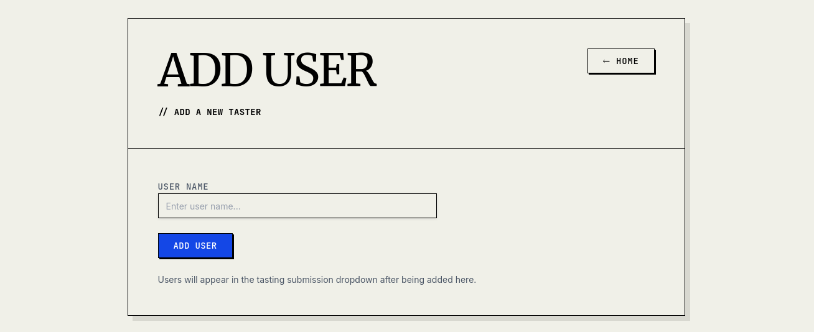
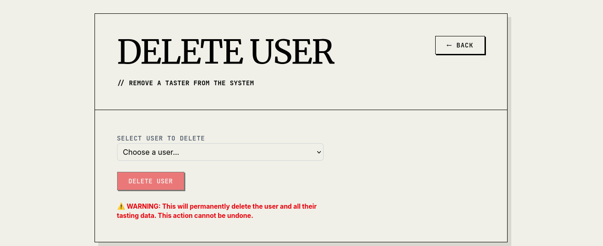

## Setup

See [SETUP.md](SETUP.md) for instructions on how to get the application running locally or with Docker.

## Deployment

### Using Published Docker Image

The application is available as pre-built Docker images on Docker Hub. Automated CI/CD pipelines ensure images are built and deployed on every code change.

- **Production**: `reasel/whiskey-tasting:latest` (latest stable release)
- **Staging**: `reasel/whiskey-tasting:staging` (latest from master branch)
- **Versioned**: `reasel/whiskey-tasting:v0.1.1` (specific release versions)

GitHub releases are automatically created for each versioned deployment, providing a paired release for every deployed version.

#### Quick Start with Docker Compose

1. **Create a docker-compose.yml file:**
   ```yaml
   services:
     whiskey-tasting:
       image: reasel/whiskey-tasting:latest
       container_name: whiskey-tasting
       ports:
         - "3010:3010"   # Frontend
         - "8010:8010"   # Backend API
       volumes:
         - whiskey-data:/app/backend/data
       environment:
         - NODE_ENV=production
         # API URL Configuration:
         # - http://localhost:8010 (default: local development)
         # - http://192.168.1.100:8010 (remote access to specific IP)
         # - relative (reverse proxy: uses relative URLs /api/v1/...)
         - NEXT_PUBLIC_API_URL=relative
         # Additional CORS Origins (comma-separated, localhost origins always included):
         # - https://yourdomain.com (reverse proxy with domain)
         # - http://192.168.1.100:3010 (remote access to specific IP)
         # - Leave empty for localhost-only development
         - CORS_ORIGINS_STR_ADDITIONAL=
         # Next.js server configuration (required for container deployment)
         - PORT=3010
         - HOSTNAME=0.0.0.0

   volumes:
     whiskey-data:
       driver: local
   ```

2. **Create an optional .env file** for easy configuration (copy from `.env.example`):
   ```bash
   cp .env.example .env
   # Then edit .env with your specific values
   ```

   Or create it manually:
   ```bash
   # .env
   NEXT_PUBLIC_API_URL=relative
   CORS_ORIGINS_STR_ADDITIONAL=https://yourdomain.com
   ```

3. **Start the application:**
   ```bash
   docker-compose up -d
   ```

4. **Access the application:**
   - Frontend: http://localhost:3010 (or your domain)
   - API Docs: http://localhost:8010/docs

#### Configuration Options

- **Local Development**: Use default settings (NEXT_PUBLIC_API_URL defaults to localhost)
- **Remote Access**: Set `NEXT_PUBLIC_API_URL=http://YOUR_HOST_IP:8010`
- **Reverse Proxy**: Set `NEXT_PUBLIC_API_URL=relative` and configure your reverse proxy to route `/api/v1/*` to `localhost:8010/api/v1/*`

#### Reverse Proxy Example (Caddy)

Create a `Caddyfile`:

```caddyfile
yourdomain.com {
    # Frontend - reverse proxy to Next.js
    reverse_proxy localhost:3010

    # Backend API - route /api/v1/* to backend
    handle /api/v1/* {
        uri strip_prefix /api/v1
        reverse_proxy localhost:8010
    }
}
```

Or for a simpler single-route setup:

```caddyfile
yourdomain.com {
    reverse_proxy localhost:3010
}
```

**Note**: Caddy automatically handles HTTPS certificates via Let's Encrypt when using a real domain. For local development, you can use `localhost` or set `tls internal` for self-signed certificates.

## CI/CD Pipeline

The project uses GitHub Actions for continuous integration and deployment. The CI/CD pipeline automates testing, building, and deploying the application.

### Automated Testing and Building

- **Triggers**: Runs on pushes to `master` branch, pull requests to `master`, and version tags (`v*`)
- **Tests**: Backend tests with pytest, frontend linting and building
- **Dependencies**: Node.js 22 for frontend, Python 3.13 for backend

### Deployment Environments

- **Staging**: Automatically deployed on every push to `master` branch
  - Docker image: `reasel/whiskey-tasting:staging`
  - Environment: `staging`

- **Production**: Automatically deployed on version tags (`v*`)
  - Docker image: `reasel/whiskey-tasting:latest` and `reasel/whiskey-tasting:vX.Y.Z`
  - Environment: `production`
  - Creates GitHub release with deployment notes

### Docker Hub Integration

Images are built and pushed to Docker Hub (`reasel/whiskey-tasting`) with appropriate tags for each environment.

## For Contributors

If you're contributing to the code, read [AGENTS.md](AGENTS.md) for guidance on build commands, testing, code style, and project patterns. It contains rules for working with the codebase.